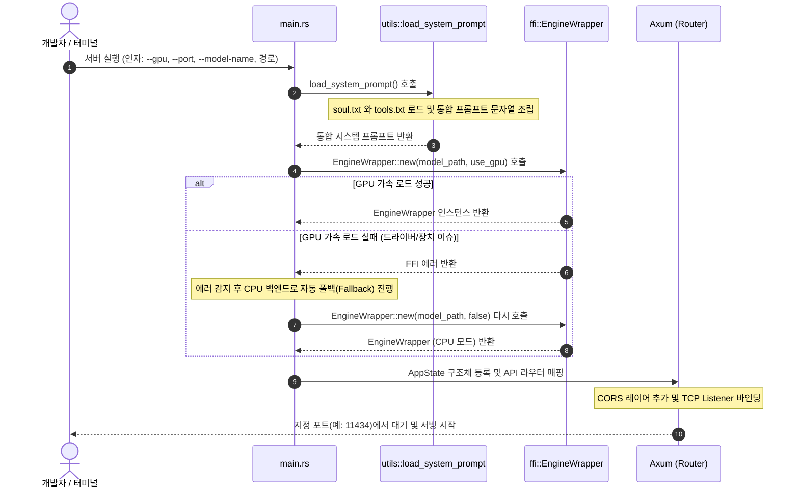
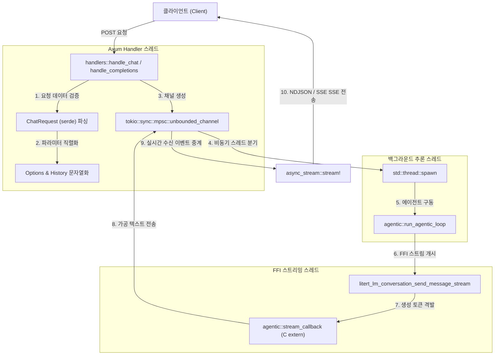
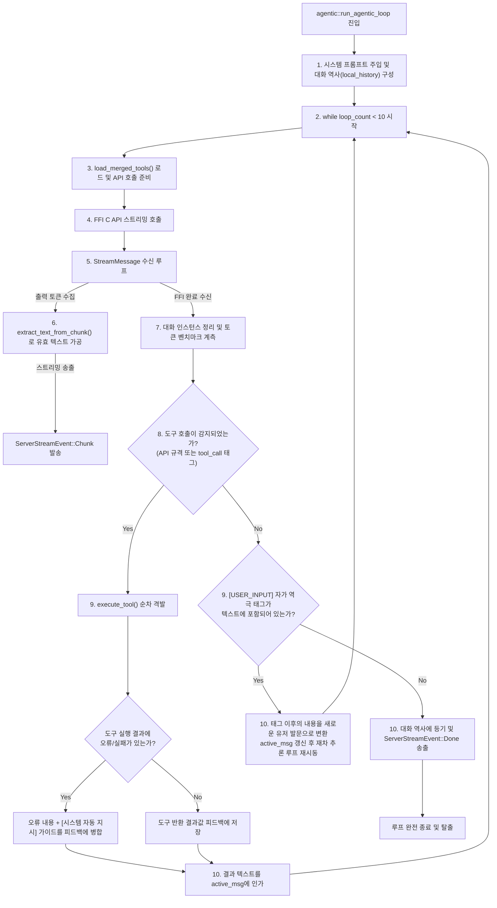

# Mais Rust Server 개발자 및 아키텍처 가이드 (Developer & Architecture Guide)

본 문서는 `rust_server` 프로젝트의 코드 베이스, 내부 모듈 간의 유기적인 동작 관계, 함수 호출 흐름, 그리고 추가 개발 및 디버깅 시 주의해야 할 아키텍처 설계 지침을 상세히 기술합니다.

---

## 1. 시스템 아키텍처 개요 (System Overview)

`rust_server`는 LiteRT-LM(TensorFlow Lite 기반 LLM 엔진) C API를 안전하게 래핑하고, Axum 웹 프레임워크를 연동하여 Ollama 및 OpenAI 규격의 API 서비스를 배포하는 고성능 자율 에이전트(Agentic) 서버 프로그램입니다.

본 서버는 AI 모델이 단순한 텍스트 답변 생성에 그치지 않고, **동적 파이썬 도구를 실시간 컴파일하여 기능을 즉시 확장하고 스스로 재귀적인 사용자 채팅을 전개(Self-Correction & Agentic Loop)**할 수 있도록 설계되었습니다.

### 모듈 구성 및 역할 (Submodule Breakdown)

```
[rust_server/src]
 ├── main.rs       : CLI 실행 인자 파싱, 엔진 생성 및 웹 서버 부트스트래퍼
 ├── ffi.rs        : LiteRT-LM C 라이브러리 원시 바인딩(sys) 안전 래핑 및 FFI 제어
 ├── utils.rs      : JSON 정제, 이스케이프 복원, 비정형 도구 추출 파서 및 로그 관리
 ├── tools.rs      : 동적 도구 파이썬 사전 검증, 등록(registry.json) 및 셸 실행
 ├── agentic.rs    : 자율 에이전트 추론 루프(Agentic Loop) 제어 및 토큰 벤치마크 계측
 └── handlers.rs   : Axum 기반 HTTP 요청 핸들러 (Ollama 및 OpenAI 호환 포맷 변환)
```

---

## 2. 모듈 간 호출 흐름도 (Mermaid Diagrams)

### 2.1. 서버 초기화 및 기동 흐름 (Initialization Sequence)
서버가 시작될 때 CLI 인자를 파싱하고, 시스템 프롬프트(성격 + 도구 가이드)를 병합하여 LiteRT-LM 엔진을 초기화하는 시퀀스입니다.



---

### 2.2. HTTP 요청 핸들링 및 백그라운드 추론 연계 (HTTP Request Workflow)
클라이언트로부터의 `/api/chat` 또는 `/v1/chat/completions` 요청이 들어와 백그라운드 스레드의 자율 에이전트 루프와 중계 채널을 구성하는 관계도입니다.



---

### 2.3. 자율 에이전트 실행 루프 (Agentic Loop Cycle)
`run_agentic_loop` 함수가 LLM 추론, 동적/정적 도구 감지, 파이썬 스크립트 실행, 자가 교정 및 자율 사용자 입력 루핑을 처리하는 순환 아키텍처 흐름도입니다.



---

### 2.4. 도구 실행 및 동적 도구 등록 아키텍처 (Tool Execution Detail)
`tools::execute_tool`이 도구 명칭을 파싱하여 동적으로 새로운 파이썬 스크립트를 작성하고 안전성을 검증하는 구조입니다.

```mermaid
graph TD
    Call["tools::execute_tool(name, arguments_json) 호출"] --> ParseArgs["1. arguments_json 파싱 및 clean_gemma_json() 정제"]
    ParseArgs --> IsCreate{"2. name == 'create_or_update_tool' 인가?"}

    %% 신규 도구 생성
    IsCreate -->|Yes| StripCode["3. 코드 블록의 마크다운 펜스(```) 제거 및 이스케이프 문자 복원"]
    StripCode --> WritePy["4. dynamic_tools/이름.py 파일로 코드 기록"]
    WritePy --> CompileCheck["5. python3 -m py_compile 구동"]
    CompileCheck --> CompileSuccess{"6. 컴파일 무사 성공?"}
    
    CompileSuccess -->|No (Syntax Error)| ErrorResult["7. 오류 스택 로그 저장 및 에러 JSON 회신"]
    CompileSuccess -->|Yes| UpdateRegistry["7. dynamic_tools/registry.json 에 함수 명세 추가"]
    UpdateRegistry --> SuccessResult["8. '등록 완료' 메시지 전달 후 로그 기록"]

    %% 일반 도구 실행
    IsCreate -->|No| FindPy{"3. dynamic_tools/이름.py 파일 존재 유무 확인"}
    FindPy -->|존재| RunPy["4. execute_dynamic_tool() 호출"]
    FindPy -->|부재| UnknownTool["4. 'Unknown tool' 반환"]
    
    RunPy --> WriteArgs["5. 임시 파라미터 파일 생성 (이름_args.json)"]
    WriteArgs --> RunSubprocess["6. python3 도구이름.py 인자파일.json 2>&1 실행"]
    RunSubprocess --> LogCall["7. exit_code 및 출력을 log_tool_call()로 영구 기록"]
    LogCall --> DeleteArgs["8. 임시 인자 JSON 파일 디스크에서 소거"]
    DeleteArgs --> ReturnOut["9. 실행 표준출력 결과를 문자열로 반환"]
```

---

## 3. 핵심 개발 및 런타임 고려사항 (Critical Guide)

본 프로그램을 사용하여 기능을 추가하거나 유지보수 개발 시 반드시 준수해야 하는 안전 지침 및 설계 배경지식입니다.

### 3.1. FFI 안전성 및 메모리 관리 (Memory Leak Prevention)
* **포인터 자원 소멸**: C API를 호출해 생성한 `LiteRtLmSessionConfig`, `LiteRtLmConversationConfig`, `LiteRtLmConversation`, `LiteRtLmBenchmarkInfo` 등의 포인터 자원은 메모리 누수(Memory Leak)를 차단하기 위해 사용이 완료되는 즉시 이에 짝매핑된 C 소멸자 API(`*_delete`)를 안전하게 호출해주어야 합니다.
* **원시 포인터 라이프타임 스코프**: 비동기 콜백 스레드(`stream_callback`)에 전달되는 사용자 데이터 주소(`tx_ptr`)는 Rust의 가비지 컬렉터 스코프를 이탈한 채 C 힙 영역에 고정 적재되어 넘어가므로(`Box::into_raw`), 호출이 끝나는 마감 턴(`StreamMessage::Final` 수신 지점) 또는 비정상 기동 종료 흐름에서 반드시 `Box::from_raw`를 이용해 소유권을 다시 Rust로 수거하여 안전하게 해제해주어야 합니다.
* **Unsafe 블록 최소화**: FFI 포인터 연산은 전적으로 `unsafe` 블록 내부에서 통제되어야 하며, Rust의 안전 가드가 해제되는 구역이므로 포인터의 `is_null()` 검증을 다이렉트 호출 직전에 필수로 수행해야 합니다.

### 3.2. GPU 백엔드 로드 폴백 메커니즘 (GPU Fallback)
* **장치 적합성 검증**: 서버 구동 시 사용자가 `--gpu` 플래그를 제공하여 실행할 때, 로컬 드라이버 환경이나 CUDA 아키텍처 불일치로 인하여 TFLite GPU delegate 초기화가 실패할 수 있습니다.
* **자동 예외 복구**: `main.rs`의 엔진 적재 흐름은 GPU 로딩 예외(`Err`) 발생 시 즉시 프로세스를 Crash시키지 않고, 에러 로그를 콘솔에 적시한 뒤 `EngineWrapper::new(model_path, false)`를 다시 시도하여 CPU 실행 모델로 완전 폴백(Fallback) 처리되도록 설계되었습니다. 이 폴백 흐름을 깨뜨리는 가짜 에러 리턴은 지양해야 합니다.

### 3.3. 동적 파이썬 실행 보안 및 샌드박싱 고려
* **독립 프로세스 격리**: 도구 실행은 `std::process::Command`를 사용해 OS 셸 프로세스를 스폰하고 파이썬 인터프리터를 기동합니다. 이 과정에서 동적 파이썬 코드 내에 무한 루프나 악의적인 파일 파괴 코드가 삽입될 우려가 있습니다.
* **컴파일 단계의 가드**: 모델이 전달한 코드 본문의 신뢰성을 확인하기 위해 파일 쓰기 완료 후 즉시 `py_compile`을 기동하여 사전 문법 오류를 완전 차단합니다.
* **향후 과제**: 보안이 매우 중요한 프로덕션 환경에 배포 시, 실행 서브 프로세스 실행에 타임아웃 제한(timeout)을 강제 적용하거나 컨테이너화된 샌드박스 내부에서만 스크립트가 실행되도록 통제하는 격리 레이어(gVisor 등)를 추가 배정해야 합니다.

### 3.4. 자가 교정 피드백 루프 (Self-Corrective Instruction Injection)
* **에이전트 자가 치료**: `agentic.rs`에서 도구 실행 결과 문자열 내에 파이썬 예외 지문(`Traceback`, `Error`, `실패` 등)이 포함된 것으로 진단된 경우, 이를 수정하여 자율적으로 재시도할 수 있도록 `[시스템 자동 지시]` 메시지를 모델 피드백 문맥에 직접 동적으로 강제 머지(Injection) 시킵니다.
* **무한 루프 방지**: 교정 시도가 무한히 지속되는 일을 구원하기 위해 에이전트의 최대 체이닝 라운드 한계 수치는 **10회**로 고정되어 있습니다. 이 루프 한계를 임의로 과도하게 늘리지 마십시오.

### 3.5. JSON 텍스트 가독성 및 이스케이프 정제 규정
* **장식 태그 제거**: Gemma 등 일부 경량 언어 모델은 대답 본문 안에 `<|\"|>` 같은 특수 토큰이나 중복 이스케이프 문자(`\\\\\"`)를 혼재하여 출력하는 특성이 있습니다. 
* **정합성 유지**: `utils::clean_gemma_json` 및 `utils::parse_all_custom_tool_calls`에 내장된 정제 규칙은 지속적으로 업데이트되어야 하며, API 통신에서 올바른 JSON 규격이 유지될 수 있도록 검증되어야 합니다.
