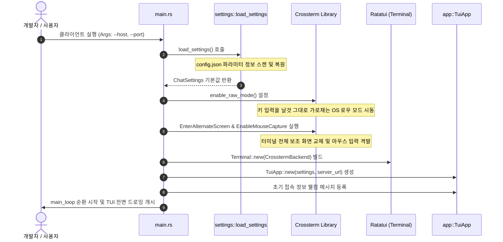

# Mais Rust UI 개발자 및 아키텍처 가이드 (Developer & Architecture Guide)

본 문서는 `rust_ui` (Terminal User Interface 클라이언트) 프로젝트의 소스 코드 구조, 주요 기능 모듈 간의 협력 구조, 그리고 런타임 제어 흐름을 명확히 시각화하여 추가 개발을 지원합니다.

---

## 1. 시스템 구조 및 모듈 아키텍처 (System Architecture)

`rust_ui`는 `ratatui`와 `crossterm` 프레임워크를 기반으로 구축된 터미널 기반 AI 챗 클라이언트입니다. 비동기 HTTP 호출을 스레드로 분리하고, 입출력 이벤트를 단일 메인 루프에서 비차단(Non-blocking) 방식으로 병렬 중계 처리합니다.

### 서브 모듈 분류 및 주요 역할

```
[rust_ui/src]
 ├── main.rs      : 터미널 로우 모드 설정/해제, 키보드 입력 스캔 및 메인 폴링 루프
 ├── settings.rs  : 하이퍼파라미터(config.json), 성격(soul.txt) 로드 및 상대 경로 확장 유틸
 ├── events.rs    : NDJSON 스트림 개행 처리, 지시 블록(작업 상태/계획) 해석 구문 분석기
 ├── app.rs       : UI 상태 상태판(TuiApp), 슬래시(/) 명령어 디스패처, 비동기 스레드 발송기
 └── ui.rs        : Ratatui 프레임에 맞춰 화면 분할(Chat, Recursive, Board, Logs) 렌더링
```

---

## 2. 핵심 제어 흐름 (Mermaid Diagrams)

### 2.1. TUI 초기화 및 구동 흐름 (TUI Boot Sequence)
터미널 환경을 날것의 원시 로우 모드(Raw Mode)로 교체하고 백엔드를 초기화하여 TuiApp을 전개하는 부트스트랩 시퀀스입니다.



---

### 2.2. 사용자 발문 발송 및 비동기 스트리밍 수신 흐름 (Async Messaging & Event Loop)
사용자가 채팅 입력창에 질문을 기입하고 엔터를 쳤을 때, UI 동결 없이 백그라운드 스레드에서 통신 스트림을 접수하여 메인 UI 스레드로 비동기 중계하는 메커니즘입니다.

```mermaid
sequenceDiagram
    autonumber
    actor User as 사용자 (TUI 화면)
    participant Main as main.rs (메인 루프)
    participant App as app::TuiApp
    participant NetThread as 백그라운드 스레드 (tokio::spawn)
    participant Parser as events::StreamParser
    participant Server as Mais Rust Server

    User->>Main: 질문 타이핑 후 Enter 키 입력
    Main->>App: send_message("질문내용", net_tx) 호출
    Note over App: is_loading = true 설정 (입력창 잠금 및 상태창 노란색 변경)
    App->>NetThread: tokio::spawn 비동기 태스크 분기 기동
    
    rect rgb(30, 40, 50)
        Note over NetThread, Server: 백그라운드 HTTP 스트림 통신 시작
        NetThread->>Server: POST /api/chat 전송 (메시지 역사 + 설정 조율)
        Server-->>NetThread: HTTP 200 OK & NDJSON 스트림 분출 시작
        
        loop 수신 바이트 청크 파이프라인
            NetThread->>NetThread: 바이트 문자열 디코딩 및 line_buffer 누적
            NetThread->>Parser: process_chunk()로 개행 문장 분석 인가
            Note over Parser: "작업 상태", "작업 계획" 및 "도구 사용" 등 판별
            Parser-->>NetThread: (NetworkEvent 묶음, 가시 텍스트 청크) 반환
            NetThread->>Main: mpsc 채널을 통한 NetworkEvent 전송 (Chunk, StatusUpdate, ToolLog 등)
        end
    end

    loop 메인 TUI 스크린 페인팅 (20ms 폴링 주기)
        Main->>Main: net_rx.try_recv() 논블로킹 스캔
        Main->>App: handle_network_event(event) 구동
        Note over App: current_assistant_response 누적 및 대시보드 상태판 실시간 갱신
        Main->>Main: terminal.draw() 호출하여 바뀐 상태값을 전면에 리페인팅
    end

    Server-->>NetThread: 최종 스트림 마감 (Done 통지 및 토큰 통계 보고)
    NetThread->>Main: NetworkEvent::Finished 전달
    Note over App: 최종 대답 역사 리스트 편입, is_loading = false 해제 및 토큰 통계 계산 완료
```



---

### 2.3. 스트림 구문 해석기 내부 상태 머신 (Stream Parser State Machine)
`StreamParser`가 개행 단위로 끊겨 유입되는 텍스트 지문 행을 파악하여 현재 파싱 영역을 유동적으로 전환하는 상태 천이도입니다.

```mermaid
stateDiagram-v2
    [*] --> NormalState : 초기 파서 상태 (일반 대화 텍스트 생성 중)

    NormalState --> StatusBlock : trimmed_line == "작업 상태" 감지
    note right of StatusBlock : in_status_block = true 설정<br>accumulated_status 목록 클리어

    NormalState --> PlanBlock : trimmed_line == "작업 계획" 감지
    note right of PlanBlock : in_plan_block = true 설정<br>accumulated_plan 목록 클리어

    StatusBlock --> StatusBlock : trimmed_line 에 ':' 문자 포함
    note right of StatusBlock : accumulated_status 에 키-값 누적<br>NetworkEvent::StatusUpdate 격발

    StatusBlock --> NormalState : ':' 가 없는 일반 텍스트 라인 감지
    note left of NormalState : in_status_block = false 설정<br>태그 정제 후 가시 텍스트로 중계

    PlanBlock --> PlanBlock : "상태:" 또는 "단계:" 포함 지문 감지
    note right of PlanBlock : accumulated_plan 에 단계 진행 사항 가산<br>NetworkEvent::PlanUpdate 격발

    PlanBlock --> NormalState : 공백 라인 또는 일반 문장 감지
    note left of NormalState : in_plan_block = false 설정<br>태그 정제 후 가시 텍스트 송출
```

---

## 3. 개발 및 확장 시 핵심 구현 고려사항 (Development Notes)

본 UI 클라이언트를 통해 기능을 고도화하거나 화면 레이아웃을 확장 수정 시 준수해야 하는 필수 가이드라인입니다.

### 3.1. TUI 렌더링 스레드의 프레임 드롭 방지 (Non-blocking I/O)
* **비차단 폴링 통제**: `main.rs` 의 메인 루프 내부에서는 절대로 블로킹 I/O 작업(예: 동기식 HTTP 요청, `std::thread::sleep`, 파일 전체 읽기 등)을 전개해서는 안 됩니다.
* **이벤트 처리**: 키보드 입력 검출을 위해 `event::poll` 에 20ms 임계 타임아웃을 부여하고, 비동기 네트워크 수신 채널 역시 비차단식인 `net_rx.try_recv()` 루프를 사용하여 수집량이 다하는 순간 즉각 드로잉(`terminal.draw`) 루프로 환원되도록 해야 합니다.

### 3.2. 터미널 로우 모드 및 화면 복구의 예외 안전성 (Terminal Safety Recovery)
* **터미널 원상 복구**: TUI 모드 구동 시 OS의 기본 터미널 입출력 인터페이스가 수정(Raw mode)되므로, 프로그램이 예외(`panic!`)나 에러로 중도 Crash될 경우 셸 화면이 먹통이 될 수 있습니다.
* **마감 안전 설계**: 프로그램 탈출 분기(`Esc` 입력 혹은 `/exit` 명령어 도달 지점) 및 예외 처리 구역에서는 무조건 아래 순서대로 터미널 리셋 핸들러를 순차 작동시켜 주어야 셸이 깨지지 않고 정상 복원됩니다.
  1. `disable_raw_mode()?` (날것의 입력 가로채기 해제)
  2. `execute!(terminal.backend_mut(), LeaveAlternateScreen, DisableMouseCapture)?` (보조 전체 화면 퇴거 및 마우스 추적 해제)
  3. `terminal.show_cursor()?` (소거한 마우스 커서 재활성화)

### 3.3. 분할 창(Pane) 독립 스크롤링 및 Tab 포커스 구조
* **포커스 스위칭**: 사용자가 `Tab` 키를 타격할 때마다 `ActivePane` 열거형 값이 순환(`Chat` ➔ `Recursive` ➔ `Board` ➔ `Logs`)하며 활성화됩니다.
* **동적 높이 산출**: 각 창은 `f.render_widget` 구역의 레이아웃 청크 높이 `saturating_sub(2)` 값을 기준으로 실시간 줄 가용 한도를 측정하여 동적으로 스크롤량을 산정하므로, 레이아웃 규격을 바꿀 때 가용 높이 계산 논리가 훼손되지 않도록 주의하십시오.
